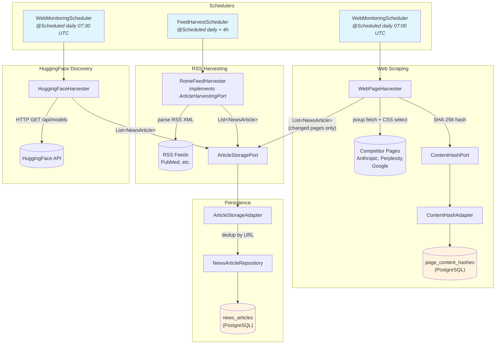
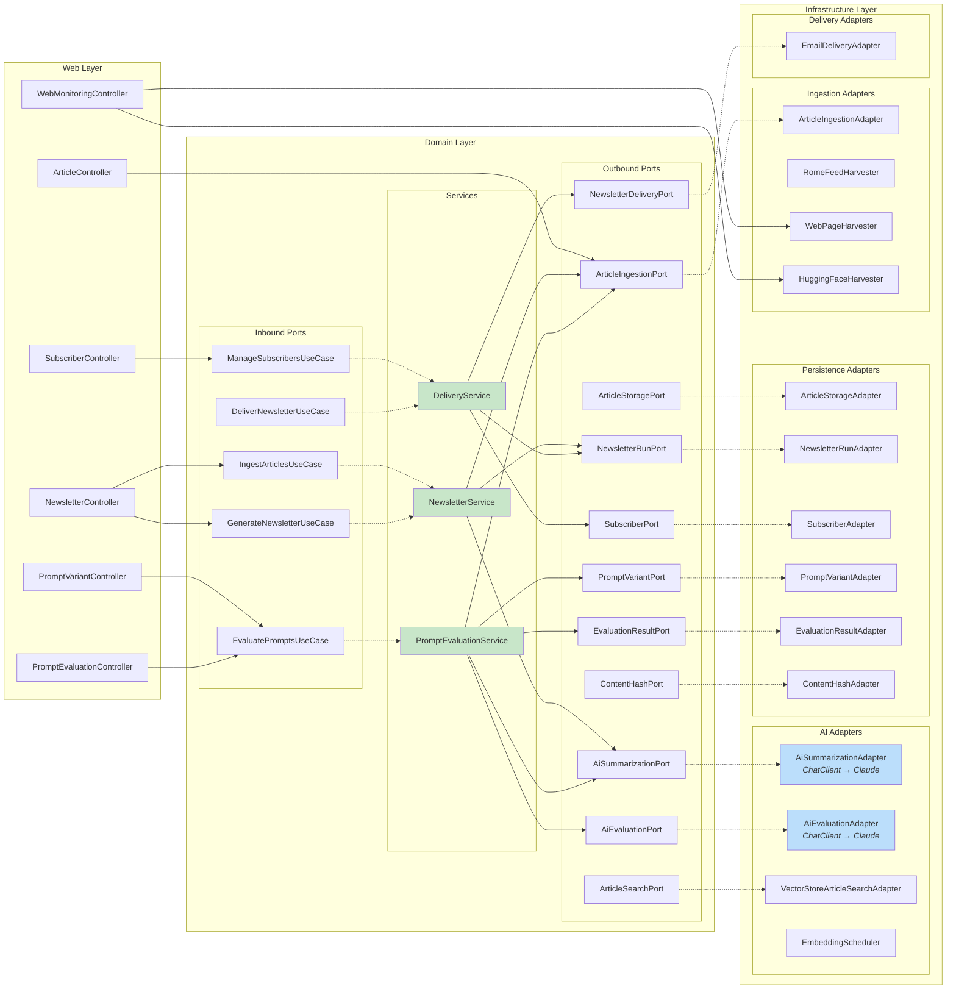

# AIHealthcare — Code Flow Diagrams

> Generated: 2026-04-20 | GitHub renders Mermaid natively — view this file on GitHub for interactive diagrams.

---

## 1. Article Ingestion Pipeline

Three independent harvesters feed articles into the shared `ArticleStoragePort`.



---

## 2. Article Query Flow

How `GET /api/v1/articles?topic=health&limit=20` is processed.

```mermaid
sequenceDiagram
    participant Client
    participant AC as ArticleController
    participant AIA as ArticleIngestionAdapter
    participant NAR as NewsArticleRepository
    participant DB as PostgreSQL

    Client->>AC: GET /articles?topic=health&limit=20
    Note over AC: log.debug("listArticles() | topic=health, limit=20")

    AC->>AIA: fetchArticles("health", 20)
    Note over AIA: log.debug("fetchArticles() | topic=health,<br/>maxArticles=20, daysBack=7")

    alt daysBack > 0
        Note over AIA: cutoff = Instant.now() - 7 days
        AIA->>NAR: findByTopicContainingIgnoreCase<br/>AndCreatedAtAfter("health", cutoff)
    else daysBack = 0
        AIA->>NAR: findByTopicContainingIgnoreCase("health")
    end

    NAR->>DB: SELECT * FROM news_articles<br/>WHERE LOWER(topic) LIKE '%health%'<br/>AND created_at > cutoff
    DB-->>NAR: List&lt;NewsArticleEntity&gt;

    NAR-->>AIA: entities (10 rows)
    Note over AIA: log.debug("query returned 10 entities")

    loop for each entity (up to limit)
        Note over AIA: toDomain() — map Entity → NewsArticle record
    end

    AIA-->>AC: List&lt;NewsArticle&gt; (10)
    Note over AC: log.debug("return=10 articles")

    loop for each article
        Note over AC: map NewsArticle → ArticleResponse DTO
    end

    AC-->>Client: 200 OK — JSON array (10 articles)
```

---

## 3. Newsletter Generation Flow

End-to-end: ingest articles, AI-summarize, render HTML, persist run.

```mermaid
sequenceDiagram
    participant Caller as Controller / Scheduler
    participant NS as NewsletterService
    participant AIP as ArticleIngestionPort
    participant ASP as AiSummarizationPort
    participant NR as NewsletterRenderer
    participant NRP as NewsletterRunPort
    participant DB as PostgreSQL

    Caller->>NS: ingest(runId, weekOf, topics, maxArticles)
    loop for each topic
        NS->>AIP: fetchArticles(topic, maxArticles)
        AIP-->>NS: List&lt;NewsArticle&gt;
    end
    NS-->>Caller: all articles (stored in memory by runId)

    Caller->>NS: generate(runId, draftId, title, tone, maxSections)
    Note over NS: retrieve articles by runId

    loop for each topic's articles
        NS->>ASP: summarize(articles, topic, tone, promptTemplate)
        Note over ASP: ChatClient → Anthropic Claude API
        ASP-->>NS: NewsletterSection
    end

    Note over NS: build NewsletterDraft(intro, sections, sources)

    NS->>NR: renderHtml(draft)
    NR-->>NS: htmlContent
    NS->>NR: renderPlainText(draft)
    NR-->>NS: plainTextContent

    NS->>NRP: save(NewsletterRun)
    NRP->>DB: INSERT INTO newsletter_runs

    NS-->>Caller: NewsletterDraft
```

---

## 4. Newsletter Delivery Flow

Scheduled or manual trigger: look up run, fetch subscribers, send emails.

```mermaid
sequenceDiagram
    participant Trigger as Scheduler / Controller
    participant DS as DeliveryService
    participant NRP as NewsletterRunPort
    participant SP as SubscriberPort
    participant NDP as NewsletterDeliveryPort
    participant SMTP as SMTP Server

    Trigger->>DS: deliver(runId)
    DS->>NRP: findByRunId(runId)
    NRP-->>DS: NewsletterRun (html + plainText)

    DS->>SP: findAllActive()
    SP-->>DS: List&lt;Subscriber&gt;

    DS->>NDP: deliver(run, subscribers)

    loop for each subscriber
        NDP->>SMTP: MIME multipart email<br/>(HTML + plain-text alternative)
        Note over NDP: catch per-recipient failures
    end

    NDP-->>DS: void

    DS->>NRP: save(run with status=SENT)
    DS-->>Trigger: void
```

---

## 5. Prompt Evaluation Flow

Compare prompt variants by having the LLM score its own output.

```mermaid
sequenceDiagram
    participant Client
    participant PEC as PromptEvaluationController
    participant PES as PromptEvaluationService
    participant PVP as PromptVariantPort
    participant AIP as ArticleIngestionPort
    participant ASP as AiSummarizationPort
    participant AEP as AiEvaluationPort
    participant ERP as EvaluationResultPort

    Client->>PEC: POST /evaluations {variantId, topic, articleIds}
    PEC->>PES: evaluate(variantId, topic, articleIds)

    PES->>PVP: findById(variantId)
    PVP-->>PES: PromptVariant

    PES->>AIP: fetchArticlesByIds(articleIds)
    AIP-->>PES: List&lt;NewsArticle&gt;

    PES->>ASP: summarize(articles, topic, tone, variant.template)
    Note over ASP: Generate section using variant's prompt
    ASP-->>PES: NewsletterSection

    PES->>AEP: evaluate(section, articles)
    Note over AEP: LLM-as-judge scores on 5 dimensions<br/>(accuracy, coverage, clarity, tone, attribution)
    AEP-->>PES: EvaluationScore

    PES->>ERP: save(EvaluationResult)
    PES-->>PEC: EvaluationResult
    PEC-->>Client: 200 OK — EvaluationResultResponse
```

---

## 6. Hexagonal Architecture Overview



---

## Configuration Reference

| Property | Default | Effect |
|---|---|---|
| `aihealthcare.articles.days-back` | `7` | Articles older than N days excluded from queries. `0` = no filter. |
| `aihealthcare.embedding.schedule` | `0 0 0 * * *` | Cron for vector embedding job |
| `aihealthcare.newsletter.schedule` | `0 0 8 * * MON` | Cron for newsletter generation |
| `aihealthcare.feeds.sources[].tier` | — | `ACADEMIC`, `REGULATORY`, `INDUSTRY`, `COMPETITOR`, `HUGGINGFACE` |
